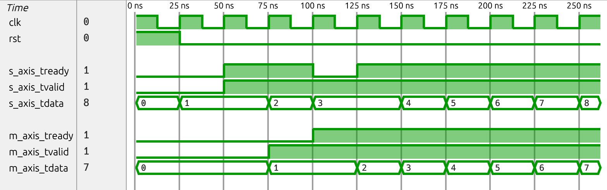
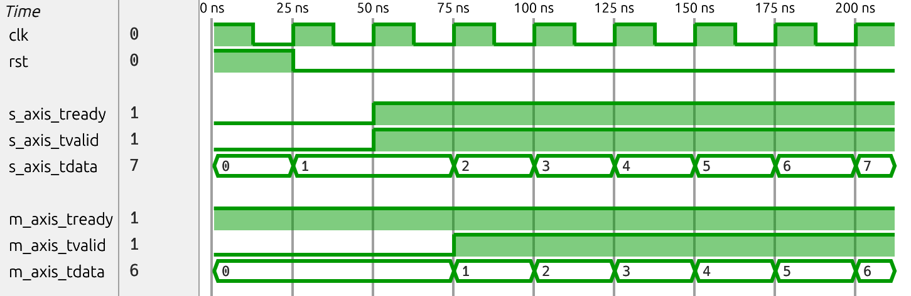

# C4 - Signal Asynchrony - AXI Stream FIFO

This README was taken from: https://github.com/efeslab/hardware-bugbase/blob/bugs/c4-signal-asynchrony-axi-stream-fifo/README.md

**Source:** Verilog-axis(Verilog AXI Stream Components): https://github.com/alexforencich/verilog-axis/commit/382226ad5966198862fb676c7a5810067c2c6a19

Bug type: Reset-Data Asynchrony

According to the Brave New World artifact, this bug occurs in an AXI-Stream 
FIFO, where despite a `reset` transaction having occurred, the FIFO 
erroneously continues to accept data being pushed (`ready` is set to 1).

In the fixed waveform, the monitor infers that a `reset` transaction
is followed by an `idle` transaction from 0-50ns, after which data
begins to be `push`-ed:

```
trace {
    Sender::reset();  // [time: 0ns -> 25ns]
    Receiver::reset();  // [time: 0ns -> 25ns]
    Sender::idle();  // [time: 25ns -> 50ns]
    Receiver::idle();  // [time: 25ns -> 50ns]
    Sender::push(1);  // [time: 50ns -> 75ns]
    ...
}
```





In the buggy waveform, at 25ns, the monitor reports that no transaction
matches the waveform:

```
All schedulers failed: No transactions match the waveform for DUT `Receiver`
Trace inferred so far by failed scheduler:
	Receiver::reset(); // [time: 0ns -> 25ns]
Trace inferred so far by scheduler for `Sender`:
	Sender::reset(); // [time: 0ns -> 25ns]
Failure at 50ns: No transactions match the waveform in `fpga-debugging/axis-async-fifo-c4/c4_buggy.fst`.
```

This is because at 25ns, the `Receiver` is not `idle` (since `m_axis_tready = 1`, not 0),
nor is it being `reset` (since `rst = 0`), and no valid data is being `pop`-ed, 
so no transaction can be inferred, surfacing the protocol violation bug.

